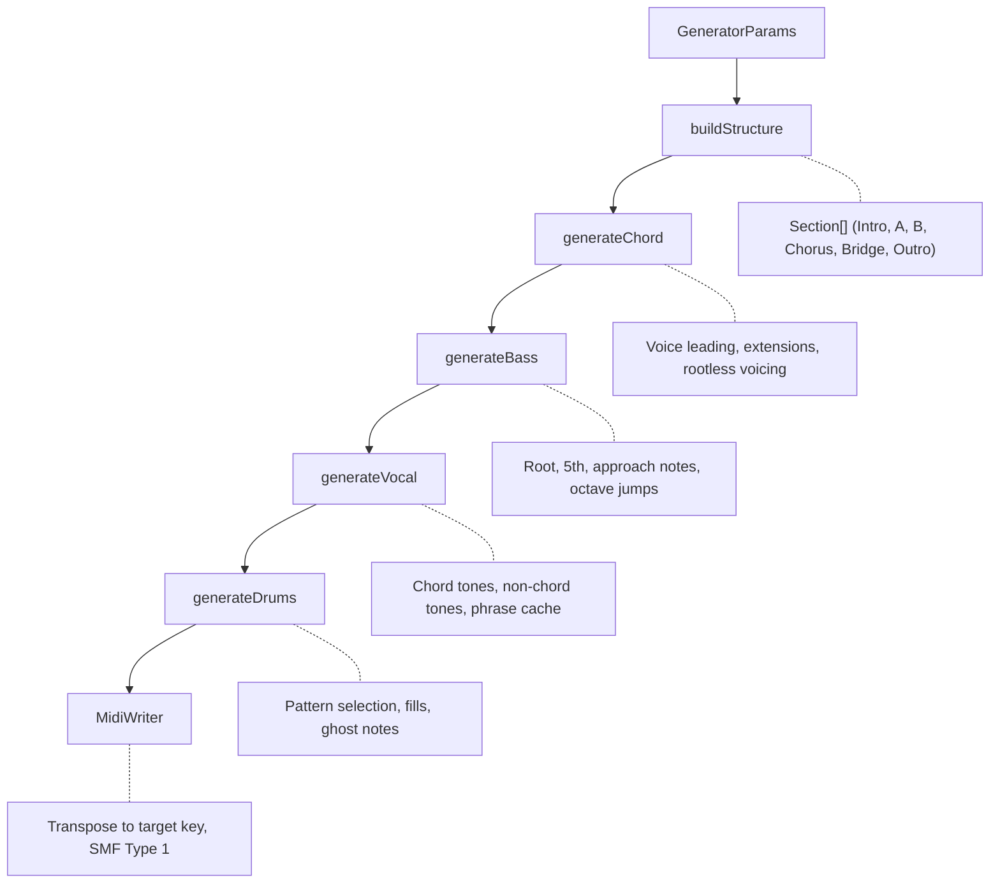
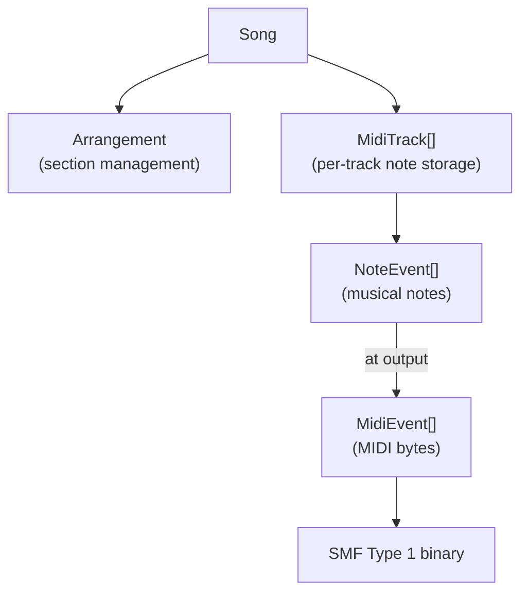

# midi-sketch

[](https://github.com/libraz/midi-sketch)
[](LICENSE)
[](https://isocpp.org/)

A C++17 library for auto-generating pop music MIDI sketches. Designed for WebAssembly deployment with zero external dependencies.

---

### 🎮 [Live Demo](https://midisketch.libraz.net/)
Generate MIDI instantly in your browser — no installation required.
*[View demo source](https://github.com/libraz/midi-sketch-homepage)*

---

## Features

### Core Generation
- **5-7 Track Output**: Vocal, Chord, Bass, Drums, Motif, Arpeggio, SE
- **Preset-based Configuration**: Structure (10), Mood (20), Chord Progression (22)
- **Deterministic Output**: Seed-based reproducible generation
- **SMF Type 1 Output**: Standard MIDI file format

### Music Theory
- **Voice Leading**: Common tone retention, minimal movement
- **Non-chord Tones**: Suspension, anticipation, passing tones
- **Chord Extensions**: 7th, 9th, sus2, sus4
- **Dynamic Velocity**: Section-based energy curves

### Composition Styles
- **MelodyLead**: Traditional melody-driven arrangement
- **BackgroundMotif**: Motif-driven with subdued vocals
- **SynthDriven**: Arpeggio-forward electronic style

## Build

```bash
# Native build
make build

# Run tests
make test

# Run CLI (generates output.mid)
./build/bin/midisketch_cli

# WASM build (requires Emscripten)
source ~/emsdk/emsdk_env.sh
make wasm

# Demo server
make demo
```

## Quick Example

### C++ API

```cpp
#include "midisketch.h"

midisketch::MidiSketch sketch;
midisketch::GeneratorParams params;
params.structure_id = 1;   // BuildUp (0-9)
params.mood_id = 0;        // StraightPop (0-19)
params.chord_id = 0;       // Canon progression (0-21)
params.key = 0;            // C major (0-11)
params.seed = 12345;       // 0 = random

sketch.generate(params);
auto midi = sketch.getMidi();       // SMF binary
auto json = sketch.getEventsJson(); // JSON events
```

### JavaScript / TypeScript (WASM)

```typescript
import { init, MidiSketch, VocalAttitude, CompositionStyle } from '@libraz/midi-sketch';

await init();

const sketch = new MidiSketch();

sketch.generate({
  structureId: 1,
  moodId: 0,
  chordId: 0,
  key: 0,
  seed: 12345
});

const midiData = sketch.getMidi();    // Uint8Array
const events = sketch.getEvents();    // Typed object

// Regenerate melody only (BGM unchanged)
sketch.regenerateMelodyEx({
  seed: 0,                               // 0 = new random
  vocalLow: 55,
  vocalHigh: 74,
  vocalAttitude: VocalAttitude.Expressive,
  compositionStyle: CompositionStyle.MelodyLead
});

sketch.destroy();
```

## Project Structure

```
midi-sketch/
├── src/
│   ├── midisketch.h/cpp      # Public API
│   ├── midisketch_c.h/cpp    # C API (WASM)
│   ├── core/
│   │   ├── types.h           # Basic types
│   │   ├── generator.cpp     # Main generator
│   │   ├── structure.cpp     # Section patterns (10)
│   │   ├── chord.cpp         # Chord progressions (22)
│   │   ├── velocity.cpp      # Dynamics calculation
│   │   └── preset_data.cpp   # Mood presets (20)
│   ├── midi/
│   │   └── midi_writer.cpp   # SMF Type 1 output
│   └── track/
│       ├── vocal.cpp         # Melody generation
│       ├── chord_track.cpp   # Chord voicing
│       ├── bass.cpp          # Bass line
│       ├── drums.cpp         # Drum patterns
│       ├── motif.cpp         # Background motif
│       ├── arpeggio.cpp      # Arpeggio patterns
│       └── se.cpp            # Section markers
├── js/
│   └── index.ts              # TypeScript wrapper
├── tests/                    # Google Test + vitest
├── demo/                     # Browser demo (Tone.js)
└── dist/                     # npm package output
```

## Technical Details

### Generation Pipeline



### Track Generation

| Track | Algorithm |
|-------|-----------|
| **Chord** | Voice leading (common tone, minimal movement), Drop2 voicing, rootless when bass has root |
| **Bass** | Root on beat 1, 5th patterns, chromatic approach notes, section-aware density |
| **Vocal** | Chord tone priority on strong beats, 4-3 suspension, anticipation, phrase repetition per section type |
| **Drums** | DrumStyle-based patterns (6 types), section-specific kicks/hats, fills at transitions |
| **Motif** | 2-4 bar patterns, tension notes (9th/11th/13th), repeat scope control |
| **Arpeggio** | Up/Down/UpDown/Random, 8th/16th/triplet speed, 1-3 octave range |

### Velocity Calculation

```
velocity = (80 + beat_adjustment) × section_multiplier × track_balance
```

| Section | Multiplier | | Track | Balance |
|---------|------------|-|-------|---------|
| Intro | 0.75 | | Vocal | 1.00 |
| A | 0.85 | | Chord | 0.75 |
| B | 1.00 | | Bass | 0.85 |
| Chorus | 1.20 | | Drums | 0.90 |
| Bridge | 0.90 | | Motif | 0.70 |
| Outro | 0.80 | | Arpeggio | 0.85 |

### Chord Progressions (22 patterns)

Supports 4-5 chord progressions with variable length:

| Type | Examples |
|------|----------|
| **4-chord** | Canon (I-V-vi-IV), Axis (vi-IV-I-V), Komuro (vi-IV-V-I) |
| **5-chord** | Extended5 (I-V-vi-iii-IV), Emotional5 (vi-IV-I-V-ii) |

Chord extensions applied probabilistically:
- sus2/sus4: Pre-dominant positions
- 7th: Dominant (V), ii chord
- 9th: Tonic (I), vi chord in Chorus

### Modulation

| Structure | Modulation Point | Amount |
|-----------|------------------|--------|
| StandardPop | B → Chorus | +1 semitone |
| RepeatChorus | Chorus 1 → 2 | +1 semitone |
| Ballad patterns | B → Chorus | +2 semitones |

### DrumStyle Patterns

| Style | Mood | Characteristics |
|-------|------|-----------------|
| Sparse | Ballad, Chill | Side stick, minimal |
| Standard | StraightPop | 8th note hi-hat |
| FourOnFloor | ElectroPop, IdolPop | 4-on-floor kick |
| Upbeat | BrightUpbeat | Syncopated, 16th hi-hat |
| Rock | LightRock | Ride cymbal |
| Synth | Yoasobi, Synthwave | Tight 16th hi-hat |

## Output

| Track | Channel | Program | Purpose |
|-------|---------|---------|---------|
| Vocal | 0 | 0 (Piano) | Melody |
| Chord | 1 | 4 (E.Piano) | Chords |
| Bass | 2 | 33 (E.Bass) | Bass line |
| Motif | 3 | 81 (Synth Lead) | Background |
| Arpeggio | 4 | 81 (Saw Lead) | Arpeggio |
| Drums | 9 | - | GM Drums |
| SE | 15 | - | Markers |

## Architecture

### Internal Design

- **All processing in C major**: Transposed to target key at MIDI output stage
- **NoteEvent-based editing**: High-level note representation (start, duration, pitch, velocity)
- **MidiEvent for output only**: Low-level MIDI bytes generated at final stage
- **constexpr presets**: All preset data embedded as compile-time constants for WASM optimization

### Class Hierarchy



### WASM Optimization

- Zero external dependencies
- No file I/O in core library
- All presets as constexpr arrays
- C API wrapper for JavaScript interop
- Output size: ~80KB (wasm) + ~17KB (JS glue)

## License

This project is licensed under the Apache License 2.0. See [LICENSE](LICENSE) for details.

### Scope Notice

This project provides a core engine, not a complete music generation system.

Sound sources, vocals, and rendering are out of scope.

Commercial licensing for extended components may be available upon request.

## Author

libraz <libraz@libraz.net>
