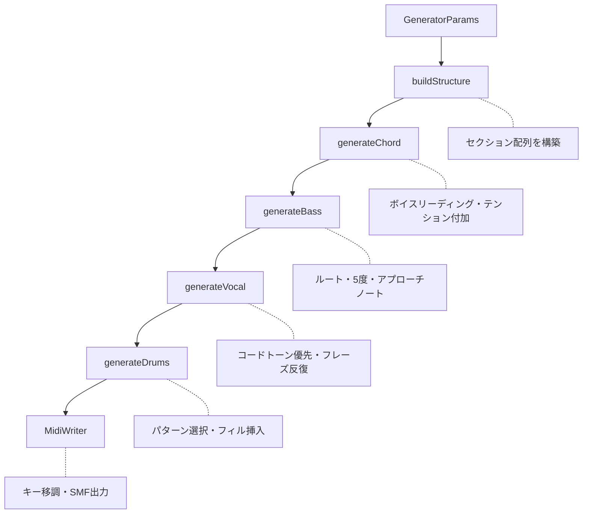
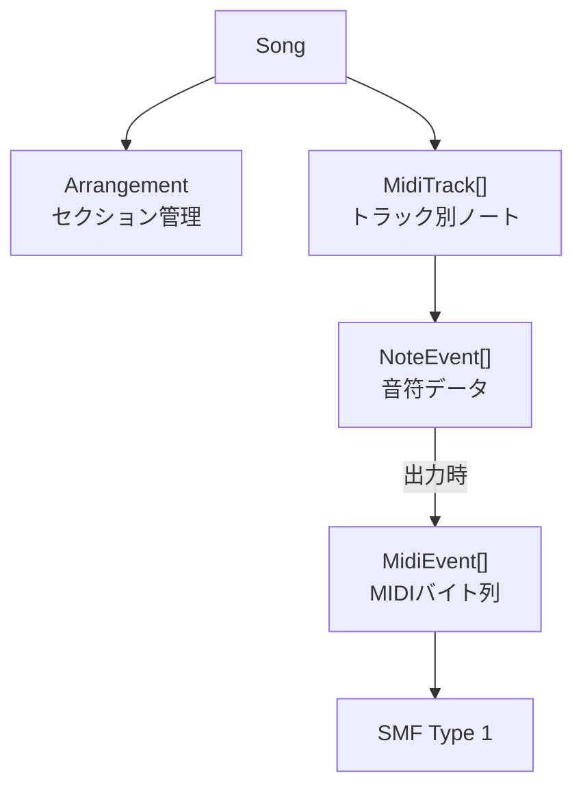

# midi-sketch

[](https://github.com/libraz/midi-sketch)
[](LICENSE)
[](https://isocpp.org/)

ポップス楽曲のMIDIスケッチを自動生成するC++17ライブラリです。
外部ライブラリに依存せず、WebAssemblyとしてブラウザ上でも動作します。

---

### 🎮 [デモ](https://midisketch.libraz.net/ja/)
インストール不要 — ブラウザで今すぐMIDI生成を体験できます。
*[デモサイトのソース](https://github.com/libraz/midi-sketch-homepage)*

---

## 特徴

### 生成機能
- **マルチトラック出力** — Vocal / Chord / Bass / Drums / Motif / Arpeggio / SE の最大7トラック
- **豊富なプリセット** — 曲構成10種 × ムード20種 × コード進行22種の組み合わせ
- **再現性のある生成** — シード値を指定すれば同一のMIDIを再生成可能
- **標準フォーマット** — SMF Type 1 形式で出力、任意のDAWで読み込み可能

### 音楽理論の適用
- **ボイスリーディング** — 共通音の保持と最小限の声部移動
- **非和声音の処理** — 掛留音・先取音・経過音を自然に配置
- **テンションコード** — 7th / 9th / sus2 / sus4 を文脈に応じて付加
- **セクション別ダイナミクス** — Aメロ→サビで盛り上がるベロシティ設計

### 3つの作曲スタイル
- **MelodyLead** — ボーカルメロディが主役の王道アレンジ
- **BackgroundMotif** — リフやモチーフが前面、ボーカルは控えめ
- **SynthDriven** — アルペジオ主体のエレクトロ系サウンド

## ビルド

```bash
# ネイティブビルド
make build

# テスト実行
make test

# CLI実行（output.mid を生成）
./build/bin/midisketch_cli

# WASMビルド（要 Emscripten）
source ~/emsdk/emsdk_env.sh
make wasm

# ブラウザデモ起動
make demo
```

## 使い方

### C++ API

```cpp
#include "midisketch.h"

midisketch::MidiSketch sketch;
midisketch::GeneratorParams params;
params.structure_id = 1;   // BuildUp (0-9)
params.mood_id = 0;        // StraightPop (0-19)
params.chord_id = 0;       // カノン進行 (0-21)
params.key = 0;            // Cメジャー (0-11)
params.seed = 12345;       // 0 でランダム

sketch.generate(params);
auto midi = sketch.getMidi();       // SMFバイナリ
auto json = sketch.getEventsJson(); // JSONイベント
```

### JavaScript / TypeScript (WASM)

```typescript
import { init, MidiSketch, VocalAttitude, CompositionStyle } from '@libraz/midi-sketch';

await init();

const sketch = new MidiSketch();

sketch.generate({
  structureId: 1,
  moodId: 0,
  chordId: 0,
  key: 0,
  seed: 12345
});

const midiData = sketch.getMidi();    // Uint8Array
const events = sketch.getEvents();    // 型付きオブジェクト

// メロディのみ再生成（BGMは維持）
sketch.regenerateMelodyEx({
  seed: 0,                               // 0 = 新しいランダム
  vocalLow: 55,
  vocalHigh: 74,
  vocalAttitude: VocalAttitude.Expressive,
  compositionStyle: CompositionStyle.MelodyLead
});

sketch.destroy();
```

## ディレクトリ構成

```
midi-sketch/
├── src/
│   ├── midisketch.h/cpp      # 公開API
│   ├── midisketch_c.h/cpp    # C API（WASM連携用）
│   ├── core/
│   │   ├── types.h           # 型定義
│   │   ├── generator.cpp     # 生成エンジン本体
│   │   ├── structure.cpp     # 曲構成パターン
│   │   ├── chord.cpp         # コード進行定義
│   │   ├── velocity.cpp      # ベロシティ計算
│   │   └── preset_data.cpp   # ムードプリセット
│   ├── midi/
│   │   └── midi_writer.cpp   # SMF書き出し
│   └── track/
│       ├── vocal.cpp         # メロディ生成
│       ├── chord_track.cpp   # コードボイシング
│       ├── bass.cpp          # ベースライン
│       ├── drums.cpp         # ドラムパターン
│       ├── motif.cpp         # 背景モチーフ
│       ├── arpeggio.cpp      # アルペジオ
│       └── se.cpp            # セクションマーカー
├── js/
│   └── index.ts              # TypeScriptラッパー
├── tests/                    # Google Test + vitest
├── demo/                     # ブラウザデモ
└── dist/                     # npmパッケージ出力
```

## 技術詳細

### 生成フロー



### 各トラックの生成ロジック

| トラック | 概要 |
|---------|------|
| **Chord** | 共通音保持と最小移動によるボイスリーディング。ベースがルートを弾く場合はルートレスボイシングを選択 |
| **Bass** | 1拍目にルート音、5度や経過音でラインを構成。セクションに応じて密度を調整 |
| **Vocal** | 強拍ではコードトーンを優先。4-3掛留や先取音で動きを付け、同一セクションではフレーズを再利用 |
| **Drums** | 6種類のDrumStyleからパターンを選択。セクション遷移時にはフィルを自動挿入 |
| **Motif** | 2〜4小節のパターンを生成し反復。B・サビではテンションノートを付加 |
| **Arpeggio** | Up / Down / UpDown / Random から選択。8分・16分・3連など速度も指定可能 |

### ベロシティ設計

```
velocity = (80 + 拍補正) × セクション係数 × トラック係数
```

| セクション | 係数 | | トラック | 係数 |
|-----------|------|-|---------|------|
| Intro | 0.75 | | Vocal | 1.00 |
| Aメロ | 0.85 | | Chord | 0.75 |
| Bメロ | 1.00 | | Bass | 0.85 |
| サビ | 1.20 | | Drums | 0.90 |
| Bridge | 0.90 | | Motif | 0.70 |
| Outro | 0.80 | | Arpeggio | 0.85 |

### コード進行（22パターン）

4〜5コードの可変長進行に対応しています。

| 種別 | 例 |
|------|-----|
| 4コード | Canon (I-V-vi-IV)、Axis (vi-IV-I-V)、小室進行 (vi-IV-V-I) |
| 5コード | Extended5 (I-V-vi-iii-IV)、Emotional5 (vi-IV-I-V-ii) |

テンションは文脈に応じて確率的に付加されます。

- **sus2 / sus4** — サブドミナント周辺で使用
- **7th** — ドミナント（V）や ii で効果的
- **9th** — トニック（I）やサビの vi で使用

### 転調

| 曲構成 | 転調タイミング | 転調量 |
|--------|---------------|--------|
| StandardPop | Bメロ → サビ | +1（半音） |
| RepeatChorus | サビ1 → サビ2 | +1（半音） |
| Ballad系 | Bメロ → サビ | +2（全音） |

### ドラムスタイル

| スタイル | 対象ムード | 特徴 |
|---------|-----------|------|
| Sparse | Ballad, Chill | サイドスティック中心、控えめ |
| Standard | StraightPop | 8ビートの基本形 |
| FourOnFloor | ElectroPop, IdolPop | 4つ打ちキック |
| Upbeat | BrightUpbeat | 16分ハイハット、シンコペーション |
| Rock | LightRock | ライドシンバル主体 |
| Synth | Yoasobi, Synthwave | タイトな16分ハイハット |

## 出力トラック

| トラック | Ch | Program | 役割 |
|---------|-----|---------|------|
| Vocal | 0 | 0 (Piano) | メロディ |
| Chord | 1 | 4 (E.Piano) | コード |
| Bass | 2 | 33 (E.Bass) | ベース |
| Motif | 3 | 81 (Synth Lead) | 背景リフ |
| Arpeggio | 4 | 81 (Saw Lead) | アルペジオ |
| Drums | 9 | — | GM準拠 |
| SE | 15 | — | マーカー |

## アーキテクチャ

### 設計方針

- **内部処理はCメジャー固定** — 出力時に指定キーへ移調
- **NoteEvent で編集** — 開始位置・長さ・ピッチ・ベロシティを保持する高レベル表現
- **MidiEvent は出力専用** — SMF書き出し時に低レベルバイト列へ変換
- **プリセットは constexpr** — コンパイル時に埋め込み、WASMサイズを最適化

### クラス構成



### WASM向け最適化

- 外部ライブラリ依存なし
- コアライブラリ内でファイルI/O禁止
- 全プリセットを constexpr 配列で定義
- JavaScript連携用にC APIラッパーを用意
- 出力サイズ: wasm 約80KB + JSグルー 約17KB

## ライセンス

Apache License 2.0 で公開しています。詳細は [LICENSE](LICENSE) をご覧ください。

### スコープについて

本プロジェクトは **MIDIスケッチ生成エンジン** を提供するものです。
完成された楽曲制作システムではありません。

- 音源・シンセサイザー
- ボーカル合成
- オーディオレンダリング

これらは本プロジェクトのスコープ外です。

拡張コンポーネントの商用ライセンスについてはお問い合わせください。

## 作者

libraz <libraz@libraz.net>
